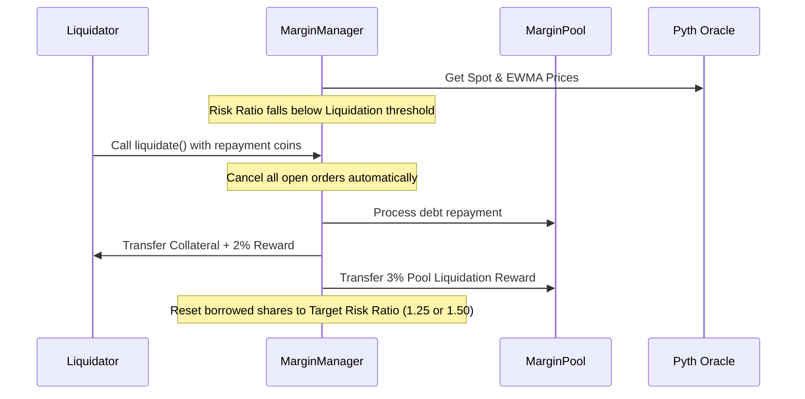

# DeepBook Margin: Margin Manager & Risk Management

The `MarginManager` is a shared object that wraps a `BalanceManager` and provides the necessary capabilities to deposit, withdraw, trade, and manage leveraged positions.

---

## 1. Mathematical Risk Ratio Model

A `MarginManager` can only borrow from one margin pool at a time (either base or quote asset) to simplify risk evaluations.

The **Risk Ratio** is defined as:
$$\text{Risk Ratio} = \frac{\text{Total Assets}}{\text{Total Debt}}$$

Where:
- **Total Assets** = Sum of collateral assets, cash balances, and open position values valued in a common denomination using oracle prices.
- **Total Debt** = Total borrowed asset balance + accrued interest.

### Leverage Calculation
Maximum leverage is determined by the **Min Borrow Risk Ratio**:
$$\text{Max Leverage} \approx \frac{1}{1 - \frac{1}{\text{Min Borrow Risk Ratio}}}$$

- **1.25 Risk Ratio** $\implies$ Approx 5x Leverage ($1 / (1 - 1/1.25) = 1 / 0.2 = 5$)
- **1.50 Risk Ratio** $\implies$ Approx 3x Leverage ($1 / (1 - 1/1.5) = 1 / (1/3) = 3$)
- **2.00 Risk Ratio** $\implies$ Approx 2x Leverage ($1 / (1 - 1/2) = 2$)

---

## 2. Move Smart Contract API

The `margin_manager` module provides the following entry and public functions:

### Creation
- `public fun new<BaseAsset, QuoteAsset>(pool: &Pool<BaseAsset, QuoteAsset>, ctx: &mut TxContext)`
  Creates and shares a new `MarginManager` associated with the specified DeepBook pool.
- `public fun new_with_initializer<BaseAsset, QuoteAsset>(pool: &Pool<BaseAsset, QuoteAsset>, ctx: &mut TxContext): (MarginManager, MarginManagerInitializer)`
  Creates a `MarginManager` and returns it along with a hot-potato initializer.
- `public fun share(manager: MarginManager, initializer: MarginManagerInitializer)`
  Shares the margin manager, consuming the initializer receipt.

### Referrals
- `public fun set_referral<BaseAsset, QuoteAsset>(manager: &mut MarginManager, pool: &Pool<BaseAsset, QuoteAsset>, referral: DeepBookPoolReferral)`
  Sets a pool-specific referral for trading fee benefits.
- `public fun unset_referral<BaseAsset, QuoteAsset>(manager: &mut MarginManager, pool: &Pool<BaseAsset, QuoteAsset>)`
  Removes the pool referral.

### Collateral Deposits & Withdrawals
- `public fun deposit<Asset>(manager: &mut MarginManager, coin: Coin<Asset>, ctx: &mut TxContext)`
  Deposit funds (must be BaseAsset, QuoteAsset, or DEEP tokens) into the margin manager. Only the owner can call this.
- `public fun withdraw<Asset>(manager: &mut MarginManager, amount: u64, ctx: &mut TxContext): Coin<Asset>`
  Withdraw funds from the margin manager. Subject to the **Min Withdraw Risk Ratio** (typically 2.0) if there is active debt.

### Lending Actions: Borrow & Repay
- `public fun borrow<BaseAsset, QuoteAsset, Asset>(manager: &mut MarginManager, pool: &mut MarginPool<Asset>, amount: u64, ctx: &mut TxContext)`
  Borrows an asset from the pool. Validates that the post-borrow risk ratio is $\ge$ **Min Borrow Risk Ratio**.
- `public fun repay<BaseAsset, QuoteAsset, Asset>(manager: &mut MarginManager, pool: &mut MarginPool<Asset>, amount: u64, ctx: &mut TxContext)`
  Repays a portion of the debt.
- `public fun repay_all<BaseAsset, QuoteAsset, Asset>(manager: &mut MarginManager, pool: &mut MarginPool<Asset>, ctx: &mut TxContext)`
  Repays all available debt using the balance manager's funds.

### Risk & Liquidation
- `public fun calculate_risk_ratio<BaseAsset, QuoteAsset>(manager: &MarginManager): u64`
  Calculates the current risk ratio scaling factor.
- `public fun liquidate<BaseAsset, QuoteAsset, Asset>(manager: &mut MarginManager, pool: &mut MarginPool<Asset>, repay_coin: Coin<Asset>, ctx: &mut TxContext): (Coin<Asset>, Coin<Asset>)`
  Liquidates an undercollateralized manager. The liquidator provides the repayment coin and receives the collateral plus the liquidation rewards.
  - Returns: `(CollateralCoin, RewardCoin)`

---

## 3. Liquidation Workflow

### Full vs. Partial Liquidation
- **Partial**: Restores the position to the **Target Liquidation Risk Ratio** by repaying a fraction of the debt. User retains the remaining position.
- **Full**: If the position is severely underwater (Assets $\le$ Debt + Rewards), all debt is cleared, assets are emptied, and the pool absorbs any remaining bad debt.

---

## 4. Events Reference

- `struct MarginManagerCreatedEvent has copy, drop`
  - Fields: `manager_id: ID`, `owner: address`, `pool_id: ID`
- `struct DepositCollateralEvent has copy, drop`
  - Fields: `manager_id: ID`, `asset_type: TypeName`, `amount: u64`
- `struct WithdrawCollateralEvent has copy, drop`
  - Fields: `manager_id: ID`, `asset_type: TypeName`, `amount: u64`
- `struct LoanBorrowedEvent has copy, drop`
  - Fields: `manager_id: ID`, `pool_id: ID`, `amount: u64`, `shares: u64`
- `struct LoanRepaidEvent has copy, drop`
  - Fields: `manager_id: ID`, `pool_id: ID`, `amount: u64`, `shares: u64`
- `struct LiquidationEvent has copy, drop`
  - Fields: `manager_id: ID`, `liquidator: address`, `repaid_amount: u64`, `collateral_seized: u64`, `reward_amount: u64`, `bad_debt: u64`
