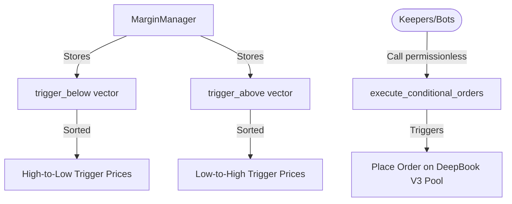

# DeepBook Margin: Take Profit & Stop Loss (TPSL)

The Take Profit Stop Loss (TPSL) module enables conditional orders that automatically execute when specific price conditions are met. This allows traders to protect positions against losses (stop loss) or capture profits (take profit) without continuous manual monitoring.

---

## 1. How TPSL Works

Conditional orders are registered with the `MarginManager` and are split into two vectors:

- **`trigger_below`**: Orders that trigger when the price falls to or below the trigger price. Sorted from **highest to lowest** trigger price to optimize execution loops.
- **`trigger_above`**: Orders that trigger when the price rises to or above the trigger price. Sorted from **lowest to highest** trigger price.
- **Keeper Execution**: Once the price crosses the trigger threshold, any keeper or bot can execute the orders permissionlessly.

---

## 2. API Helper Functions (`tpsl` module)

These functions return structs to configure the conditions and the orders that will be placed upon trigger.

### Creating Conditions
- `public fun new_condition(trigger_price: u64, trigger_above: bool): Condition`
  Defines whether the order triggers when the price is above (`trigger_above = true`) or below (`trigger_above = false`) the `trigger_price`.

### Creating Pending Orders
- `public fun new_pending_limit_order(price: u64, quantity: u64, is_bid: bool, restriction: u8, self_matching_option: u8): PendingOrder`
  Creates a pending limit order config.
  - *Note*: Restriction options must be `no_restriction` or `immediate_or_cancel`.
- `public fun new_pending_market_order(quantity: u64, is_bid: bool, self_matching_option: u8): PendingOrder`
  Creates a pending market order config.

---

## 3. Managing Conditional Orders (`margin_manager` module)

These functions on the `MarginManager` shared object register, cancel, and execute the configured TPSL conditions.

- `public fun add_conditional_order<BaseAsset, QuoteAsset>(manager: &mut MarginManager, pool: &Pool<BaseAsset, QuoteAsset>, condition: Condition, order: PendingOrder, ctx: &mut TxContext)`
  Registers a conditional order. Validates that the trigger price does not violate current spot prices (e.g., cannot set a stop-loss below price that has already triggered).
- `public fun cancel_conditional_order<BaseAsset, QuoteAsset>(manager: &mut MarginManager, order_id: u64, ctx: &mut TxContext)`
  Cancels a specific conditional order by its ID.
- `public fun cancel_all_conditional_orders<BaseAsset, QuoteAsset>(manager: &mut MarginManager, ctx: &mut TxContext)`
  Cancels all conditional orders on this margin manager.
- `public fun execute_conditional_orders<BaseAsset, QuoteAsset>(manager: &mut MarginManager, pool: &mut Pool<BaseAsset, QuoteAsset>, clock: &Clock, ctx: &mut TxContext)`
  **Permissionless** entrypoint called by bots/keepers. It queries current pool prices, traverses the `trigger_above` / `trigger_below` vectors, and executes all triggered conditional orders.

---

## 4. Events Reference

- `struct ConditionalOrderAdded has copy, drop`
  - Fields: `manager_id: ID`, `order_id: u64`, `trigger_price: u64`, `trigger_above: bool`
- `struct ConditionalOrderCancelled has copy, drop`
  - Fields: `manager_id: ID`, `order_id: u64`
- `struct ConditionalOrderExecuted has copy, drop`
  - Fields: `manager_id: ID`, `order_id: u64`, `placed_order_id: u128`
- `struct ConditionalOrderInsufficientFunds has copy, drop`
  - Fields: `manager_id: ID`, `order_id: u64` (Fired if the margin manager lacked sufficient margin assets to open the order when triggered)
