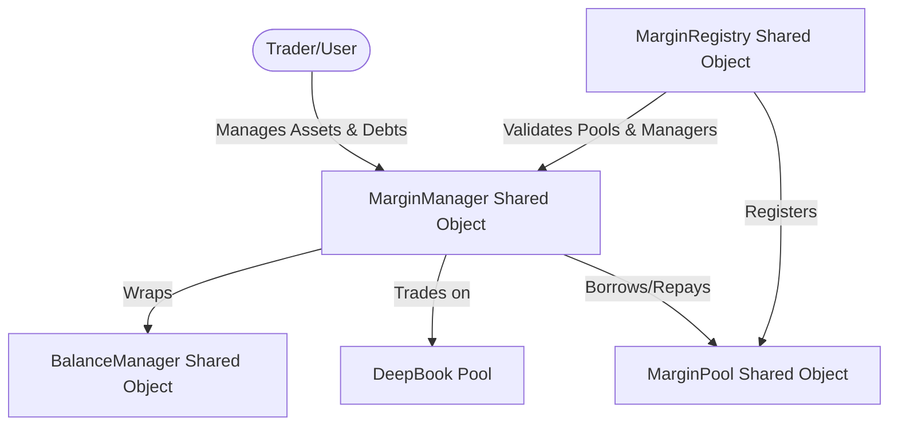

# DeepBook Margin: Overview, Design & Registry

DeepBook Margin extends the trading capabilities of DeepBook V3 by enabling leveraged trading positions. With margin trading, users can borrow funds from on-chain margin pools to increase their buying power, collateralizing their positions under dynamic risk management parameters.

---

## 1. Core Architecture

The margin system coordinates four main objects:

1. **`MarginPool`**: A shared object managing liquidity for a specific asset. It handles supplying, borrowing, and interest accrual.
2. **`MarginManager`**: A shared object wrapping a `BalanceManager` that adds borrowing, repayment, and risk management capability.
3. **`MarginRegistry`**: A central coordination object that tracks all margin pools, tracks margin managers, and stores enabled pool risk configurations.
4. **`BalanceManager`**: The base DeepBook V3 balance container.

---

## 2. Contract Information & Supported Coins

### Deployment Details (Mainnet v3)
- **Margin Package ID**: `0xfbd322126f1452fd4c89aedbaeb9fd0c44df9b5cedbe70d76bf80dc086031377`
- **Registry ID**: `0x0e40998b359a9ccbab22a98ed21bd4346abf19158bc7980c8291908086b3a742`

### Version History
* **Version 3 (Active)**: `0xfbd322126f1452fd4c89aedbaeb9fd0c44df9b5cedbe70d76bf80dc086031377` (Bug fix in market order function, Feb 10, 2026)
* **Version 2 (Disabled)**: `0xcb4fc91921494ebe6979e201fdb2d67388ffdf6a1b1eb4952526259074de8d0b` (Oracle slippage prevention for margin managers, Feb 10, 2026)
* **Version 1 (Disabled)**: `0x97d9473771b01f77b0940c589484184b49f6444627ec121314fae6a6d36fb86b` (Original deployment, Jan 13, 2026)

### Supported Coins
- **SUI**: `0x0000000000000000000000000000000000000000000000000000000000000002::sui::SUI` (9 Decimals)
- **Native USDC**: `0xdba34672e30cb065b1f93e3ab55318768fd6fef66c15942c9f7cb846e2f900e7::usdc::USDC` (6 Decimals)
- **DEEP**: `0xdeeb7a4662eec9f2f3def03fb937a663dddaa2e215b8078a284d026b7946c270::deep::DEEP` (6 Decimals)
- **WAL**: `0x356a26eb9e012a68958082340d4c4116e7f55615cf27affcff209cf0ae544f59::wal::WAL` (9 Decimals)
- **SUIUSDE**: `0x41d587e5336f1c86cad50d38a7136db99333bb9bda91cea4ba69115defeb1402::sui_usde::SUI_USDE` (6 Decimals)

---

## 3. Margin Pools Configuration

Lenders supply liquidity to pools to earn interest. Borrowers take out loans from these pools.

| Pool Type | Pool Object ID | Supply Cap | Max Utilization | Referral Spread | Min Borrow Size |
| :--- | :--- | :--- | :--- | :--- | :--- |
| **SUI** | `0x53041c6f86c4782aabbfc1d4fe234a6d37160310c7ee740c915f0a01b7127344` | 500,000 SUI | 90% | 20% | 0.1 SUI |
| **USDC** | `0xba473d9ae278f10af75c50a8fa341e9c6a1c087dc91a3f23e8048baf67d0754f` | 2,000,000 USDC | 90% | 20% | 0.1 USDC |
| **DEEP** | `0x1d723c5cd113296868b55208f2ab5a905184950dd59c48eb7345607d6b5e6af7` | 30,000,000 DEEP | 90% | 20% | 0.1 DEEP |
| **WAL** | `0x38decd3dbb62bd4723144349bf57bc403b393aee86a51596846a824a1e0c2c01` | 7,000,000 WAL | 90% | 20% | 0.1 WAL |
| **SUIUSDE** | `0xbb990ca04a7743e6c0a25a7fb16f60fc6f6d8bf213624ff03a63f1bb04c3a12f` | 1,000,000 SUIUSDE | 90% | 20% | 0.1 SUIUSDE |

---

## 4. Risk Ratios & Leverage Limits

Risk parameters govern maximum leverage limits and liquidation trigger thresholds:

### SUI/USDC (5x Leverage)
- **Min Withdraw Risk Ratio**: 2.0 (Must maintain $\ge 2.0$ ratio to withdraw collateral)
- **Min Borrow Risk Ratio**: 1.25 (Must maintain $\ge 1.25$ ratio to borrow more assets)
- **Liquidation Risk Ratio**: 1.10 (Position becomes eligible for liquidation if ratio $\le 1.10$)
- **Target Liquidation Risk Ratio**: 1.25 (Liquidators restore position to this ratio)
- **Liquidation Reward split**: 5% total (2% to liquidator, 3% to pool)

### WAL/USDC & DEEP/USDC (3x Leverage)
- **Min Withdraw Risk Ratio**: 2.0
- **Min Borrow Risk Ratio**: 1.50 (Allows approx. 3x leverage)
- **Liquidation Risk Ratio**: 1.20 (Liquidatable if ratio $\le 1.20$)
- **Target Liquidation Risk Ratio**: 1.50
- **Liquidation Reward split**: 5% total (2% to liquidator, 3% to pool)

### Warning & Risk Zones (SUI/USDC vs 3x Leverage pairs)

| Status | SUI/USDC Risk Ratio | WAL & DEEP/USDC Risk Ratio | Description |
| :--- | :--- | :--- | :--- |
| **Safe** | $\ge 1.25$ | $\ge 1.50$ | Minimum borrow ratio met. Position is healthy. |
| **Warning** | $1.10 \text{ to } 1.20$ | $1.20 \text{ to } 1.30$ | Close to liquidation. Price moves can trigger liquidation. |
| **Danger** | $1.10 \text{ to } 1.15$ | $1.20 \text{ to } 1.25$ | Extreme risk of liquidation. |
| **Liquidatable** | $\le 1.10$ | $\le 1.20$ | Anyone can execute partial liquidation. |
| **Underwater** | $\le 1.00$ | $\le 1.00$ | Assets do not cover debt. Lending pool absorbs bad debt. |

---

## 5. Oracle Pricing & Safeguards

DeepBook Margin relies on Pyth network oracles to query asset prices. Safeguards include:
- **Staleness Protection**: Pyth prices older than 60 seconds are automatically rejected.
- **Confidence Intervals**: The protocol validates that confidence intervals are within strict bounds.
- **EWMA Verification**: Spot oracle values are validated against an Exponentially Weighted Moving Average (EWMA) price to filter spikes.
