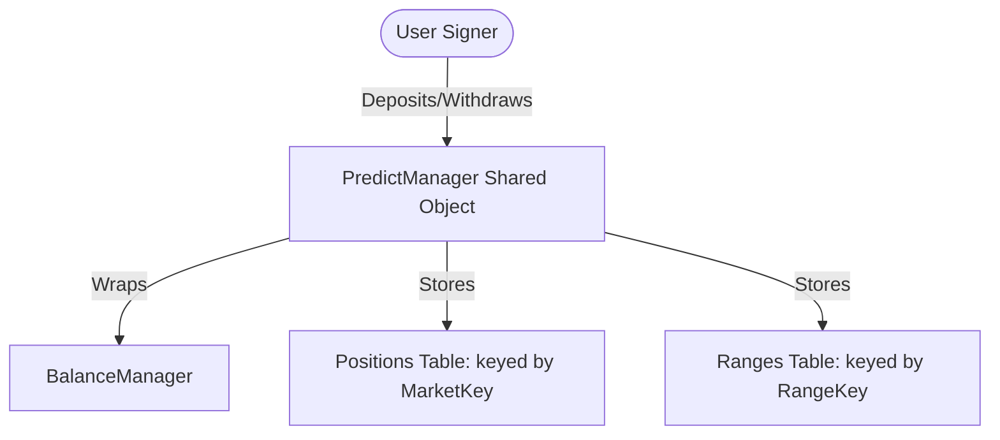

# DeepBook Predict: Predict Manager

The `PredictManager` is a per-user shared account object. It wraps a DeepBook V3 `BalanceManager`, stores deposited quote balances, and tracks a user's active binary position and vertical range quantities.

---

## 1. Structural Design

- **Per-User Shared Object**: Each user creates a single `PredictManager` and reuses it across all Predict markets.
- **Embedded Balances**: It wraps a DeepBook V3 `BalanceManager`, housing deposited quote assets.
- **Internal Storage**: Positions and ranges are **not** minted as standalone objects. Instead, their quantities are recorded as values inside internal tables inside the `PredictManager`, preventing object fragmentation.
  - Binary positions are tracked in a table keyed by `MarketKey`.
  - Vertical ranges are tracked in a table keyed by `RangeKey`.

---

## 2. Move Smart Contract API

The `predict_manager` module exposes the following entry and public functions:

### Account Creation
- `public entry fun create_manager(predict: &mut Predict, ctx: &mut TxContext)`
  Creates and shares a new `PredictManager` associated with the caller. Emits `PredictManagerCreated`.

### Collateral Deposits & Withdrawals
- `public fun deposit<QuoteAsset>(manager: &mut PredictManager, coin: Coin<QuoteAsset>, ctx: &mut TxContext)`
  Deposits quote assets into the manager prior to minting positions. Only the owner can call this.
- `public fun withdraw<QuoteAsset>(manager: &mut PredictManager, amount: u64, ctx: &mut TxContext): Coin<QuoteAsset>`
  Withdraws quote assets from the manager. Only the owner can call this.

### Read-Only Accessors
- `public fun owner(manager: &PredictManager): address`
  Returns the owner's address.
- `public fun balance<QuoteAsset>(manager: &PredictManager): u64`
  Returns the deposited balance of the specified quote asset.
- `public fun position_quantity(manager: &PredictManager, key: MarketKey): u64`
  Returns the quantity of binary positions owned for the specified `MarketKey`.
- `public fun range_quantity(manager: &PredictManager, key: RangeKey): u64`
  Returns the quantity of vertical range positions owned for the specified `RangeKey`.

---

## 3. Events Reference

- `struct PredictManagerCreated has copy, drop`
  - Fields: `manager_id: ID`, `owner: address`
