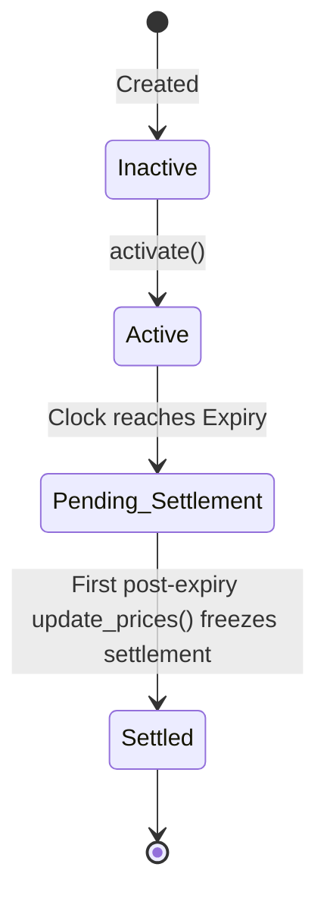

# DeepBook Predict: Oracle SVI State Machine

An `OracleSVI` object manages the market state for one underlying asset at a specific expiry. It houses spot and forward prices, SVI (Stochastic Volatility Inspired) volatility surface configurations, and the final frozen settlement value.

---

## 1. Oracle Lifecycle States

An oracle transitions sequentially through four lifecycle states:

1. **`Inactive`** (status code `0`): Created but not open for trading.
2. **`Active`** (status code `1`): Accepts live price and SVI volatility updates. Mints require the oracle to be active.
3. **`Pending Settlement`** (status code `2`): Option has expired. Waiting for a post-expiry oracle update.
4. **`Settled`** (status code `3`): The first price update post-expiry freezes the settlement price. Rejects further updates. Redeems can resolve against settled state.

---

## 2. API Reference (`oracle` module)

### Oracle Management
- `public fun activate(oracle: &mut OracleSVI, cap: &OracleSVICap)`
  Activates an inactive oracle before its expiry timestamp.
- `public fun update_prices(oracle: &mut OracleSVI, price_data: PriceData, clock: &Clock, cap: &OracleSVICap)`
  Pushes spot and forward prices. If the oracle is past expiry and pending settlement, this freezes the settlement price, transitioning the oracle to `Settled`.
- `public fun update_svi(oracle: &mut OracleSVI, svi: SVIParams, clock: &Clock, cap: &OracleSVICap)`
  Pushes updated SVI volatility parameters before expiry.

### Struct Constructors
- `public fun new_price_data(spot: u64, forward: u64): PriceData`
  Constructs a new price update payload.
- `public fun new_svi_params(a: u64, b: u64, rho: u64, m: u64, sigma: u64): SVIParams`
  Constructs SVI volatility surface parameters.

### Read-Only Accessors
- `public fun id(oracle: &OracleSVI): ID`
- `public fun underlying(oracle: &OracleSVI): String`
- `public fun expiry(oracle: &OracleSVI): u64`
- `public fun status(oracle: &OracleSVI): u8`
- `public fun spot_price(oracle: &OracleSVI): u64`
- `public fun forward_price(oracle: &OracleSVI): u64`
- `public fun settlement_price(oracle: &OracleSVI): u64`
- `public fun last_update_timestamp(oracle: &OracleSVI): u64`

### Lifecycle Status Constants
- `public fun status_inactive(): u8` (returns `0`)
- `public fun status_active(): u8` (returns `1`)
- `public fun status_pending_settlement(): u8` (returns `2`)
- `public fun status_settled(): u8` (returns `3`)

---

## 3. Events Reference

- `struct OracleActivated has copy, drop`
  - Fields: `oracle_id: ID`
- `struct OraclePricesUpdated has copy, drop`
  - Fields: `oracle_id: ID`, `spot: u64`, `forward: u64`, `timestamp: u64`
- `struct OracleSVIUpdated has copy, drop`
  - Fields: `oracle_id: ID`, `a: u64`, `b: u64`, `rho: u64`, `m: u64`, `sigma: u64`, `timestamp: u64`
- `struct OracleSettled has copy, drop`
  - Fields: `oracle_id: ID`, `settlement_price: u64`, `timestamp: u64`
